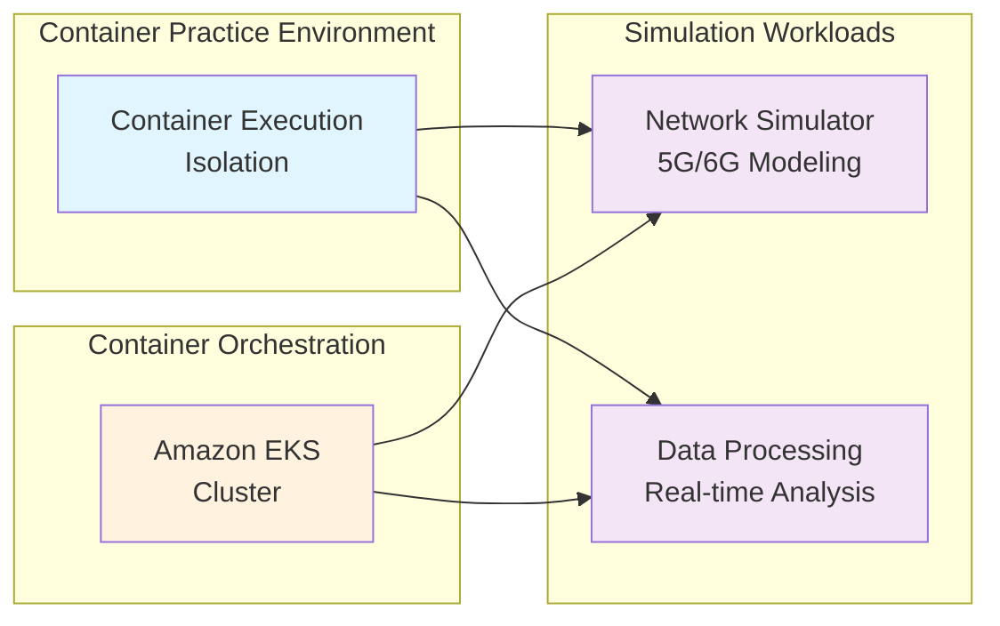

# Getting Started

This workshop provides a hands-on learning experience combining NVIDIA Sionna for communication simulation with container technologies.

## 🎯 Ideal Environment

This workshop aims to build an ideal Telco research development and management platform with the following goals:

- **Scalable simulation environment** - Run 5G/6G network simulations
- **Integrated version management** - Version control for research data and experimental environments
- **Automated scaling** - Dynamic resource management based on research requirements

## 🏗️ Telco Research Platform Architecture

Here's the platform structure we'll work towards together:

**Workflow:**
1. **Researchers use containers** - Leverage container benefits through Docker environments
2. **Requests scale efficiently** - Made possible through EKS clusters

## 🚀 Why Use Containers for Telco Research?

Through this workshop, you'll see how containers and EKS provide an excellent foundation for telecommunications research platforms:



{{< tab "Scalability" }}
**Dynamic Infrastructure**
- Auto-scaling based on research workload demand
- AWS specialized hardware support (high-performance computing, dedicated instances)
- Distributed simulation capabilities
- Multi-workload deployment patterns


{{< tab "Flexibility" }}
**Choice and Control**
- Self-hosted simulation tools
- Managed cloud services integration
- Hybrid deployment patterns
- Custom optimization strategies


{{< tab "Operations" }}
**Operational Excellence**
- Comprehensive observability through CloudWatch
- Automated lifecycle management with Helm
- Cost optimization and tracking
- Security best practices




## 🏗️ Built on AWS Container Best Practices

This workshop leverages **AWS Container Best Practices** - a comprehensive reference architecture that you can use to deploy similar platforms in your own AWS account.

**What this means for you:**
- All patterns you learn are battle-tested and scalable
- You can deploy the same infrastructure in your own environment
- Best practices provide Terraform, Helm charts, and documentation
- Your learning translates directly to real-world deployments

## Next Steps

Once environment preparation is complete, start with [Docker Basics](/30-docker-basics) and proceed step by step.
