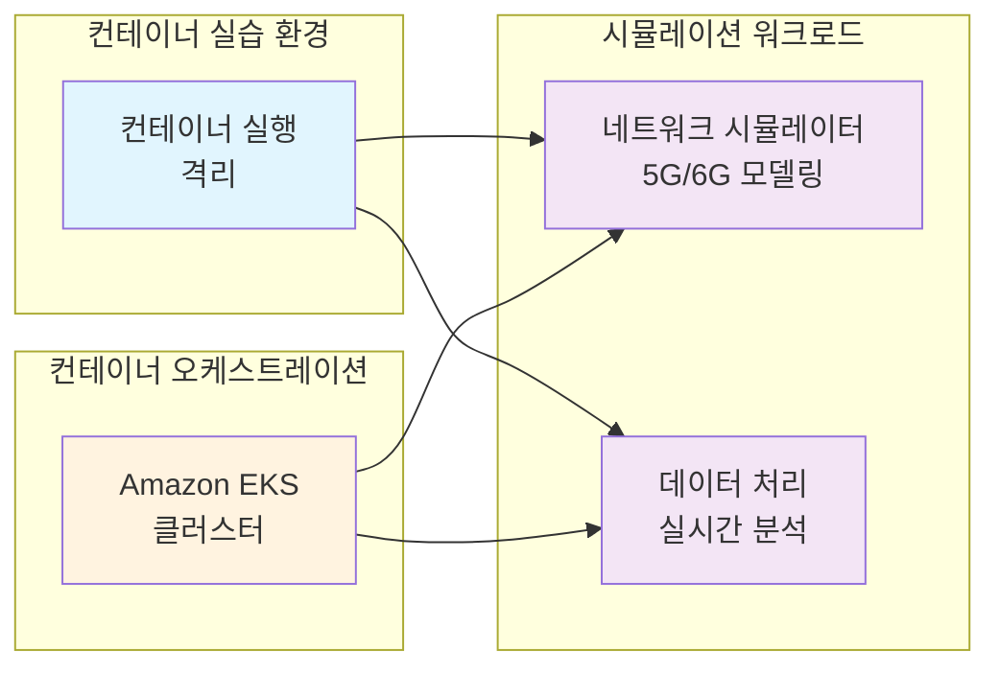

# 시작하기

이 워크샵에서는 NVIDIA Sionna를 활용한 통신 시뮬레이션과 컨테이너 기술을 결합하여 실습 중심의 학습 경험을 제공합니다.

## 🎯 이상적인 환경

이 워크샵은 다음과 같은 이상적인 Telco 연구 개발 및 관리 플랫폼을 목표로 진행을 합니다:

- **확장 가능한 시뮬레이션 환경** - 5G/6G 네트워크 시뮬레이션 실행
- **버전 통합 관리** - 연구 데이터 및 실험 환경에 대한 버전 관리
- **자동화된 스케일링** - 연구 요구사항에 따른 동적 리소스 관리

## 🏗️ Telco 연구 플랫폼 아키텍처

함께 지향할 플랫폼 구조입니다:

**워크플로우:**
1. **연구자들이 컨테이너로** - Docker 환경 사용을 통해 컨테이너 이점을 활용할 수 있습니다.
2. **요청이 확장성있게** - EKS 클러스터를 통해 가능합니다.

## 🚀 Telco 연구에 컨테이너를 사용하는 이유?

이 워크샵을 통해 컨테이너 및 EKS가 통신 연구 플랫폼에 탁월한 기반을 제공하는 이유를 확인할 수 있습니다:



{{< tab "확장성" }}
**동적 인프라**
- 연구 워크로드 수요에 따른 자동 스케일링
- AWS 전용 하드웨어 지원 (고성능 컴퓨팅, 전용 인스턴스)
- 분산 시뮬레이션 기능
- 멀티 워크로드 배포 패턴


{{< tab "유연성" }}
**선택과 제어**
- 자체 호스팅 시뮬레이션 도구
- 관리형 클라우드 서비스 통합
- 하이브리드 배포 패턴
- 맞춤형 최적화 전략


{{< tab "운영" }}
**운영 우수성**
- CloudWatch를 통한 포괄적 관찰성
- Helm을 통한 자동화된 라이프사이클 관리
- 비용 최적화 및 추적
- 보안 모범 사례




## 🏗️ AWS 컨테이너 모범 사례 기반

이 워크샵은 **AWS 컨테이너 모범 사례**를 활용합니다 - 자체 AWS 계정에서 유사한 플랫폼을 배포하는 데 사용할 수 있는 포괄적인 참조 아키텍처입니다.

**이것이 의미하는 바:**
- 학습하는 모든 패턴은 실전에서 검증되고 확장 가능합니다
- 자체 환경에서 동일한 인프라를 배포할 수 있습니다
- 모범 사례는 Terraform, Helm 차트 및 문서를 제공합니다
- 학습한 내용이 실제 배포로 직접 전환됩니다

## 다음 단계

환경 준비가 완료되면 [Docker 기초](/30-docker-basics)부터 시작하여 단계별로 진행해주세요.

