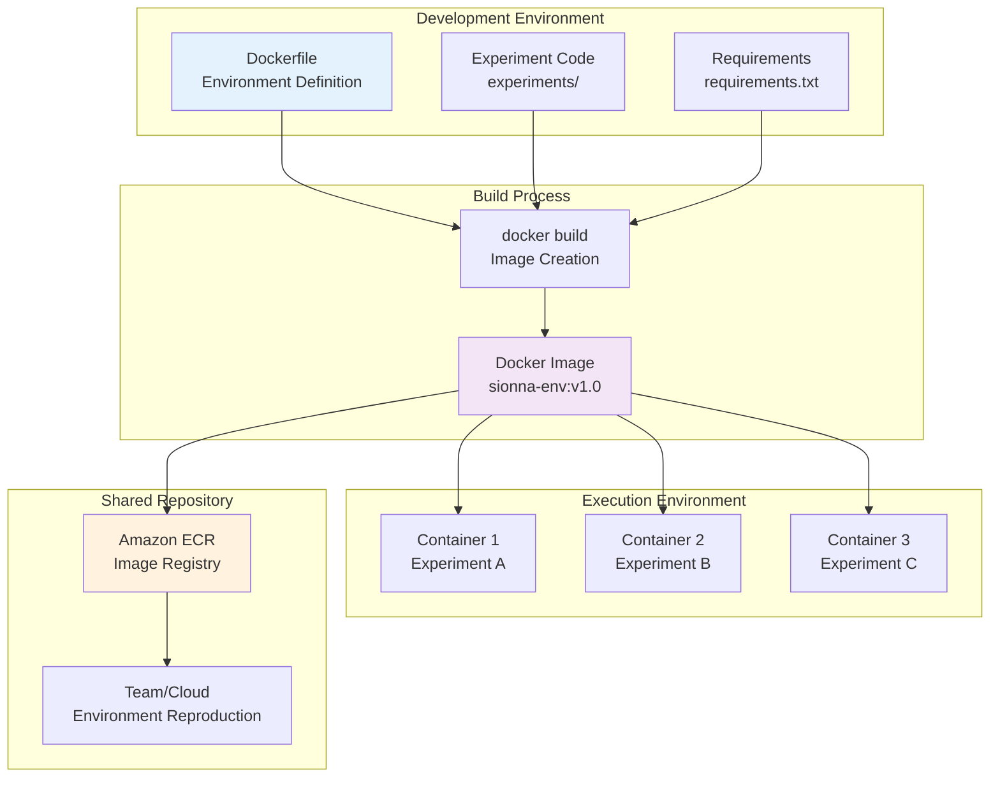
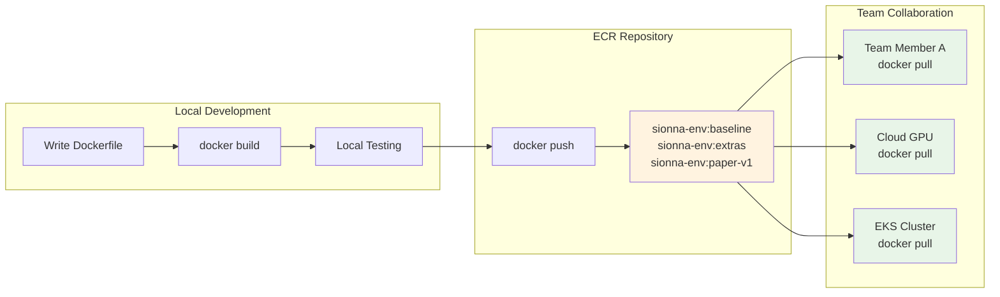

# Sionna Concepts Introduction

**Reproducible Environments for GPU-Accelerated 6G Research**

NVIDIA Sionna is an open-source Python library for 6G wireless communication research. Built on TensorFlow, it supports large-scale link-level simulations through GPU acceleration. In this section, you'll learn about Sionna's core concepts and the necessity of environment isolation through Docker.

## 🔬 NVIDIA Sionna Library Overview

### What is Sionna?

NVIDIA Sionna is an open-source Python library for 6G wireless communication research:

- **Link-level Simulation**: Physical layer communication system modeling
- **TensorFlow-based**: Integration of deep learning and communication simulation
- **GPU Acceleration**: Parallel processing for large-scale simulations
- **Research-focused**: Optimized for academic research and prototyping

### Key Components

```mermaid
graph TB
    subgraph "Sionna Architecture"
        A[Channel Models<br/>채널 모델]
        B[MIMO Systems<br/>MIMO 시스템]
        C[OFDM Processing<br/>OFDM 처리]
        D[FEC Coding<br/>FEC 코딩]
    end
    
    subgraph "TensorFlow Integration"
        E[GPU Acceleration<br/>GPU 가속]
        F[Automatic Differentiation<br/>자동 미분]
        G[Neural Networks<br/>신경망]
        H[Optimization<br/>최적화]
    end
    
    A --> E
    B --> F
    C --> G
    D --> H
    
    style A fill:#e3f2fd
    style B fill:#e3f2fd
    style C fill:#e3f2fd
    style D fill:#e3f2fd
    style E fill:#f3e5f5
    style F fill:#f3e5f5
    style G fill:#f3e5f5
    style H fill:#f3e5f5
```



### Applications in 6G Research

| Research Area | Sionna Application | Examples |
|---------------|-------------------|----------|
| **Channel Modeling** | 3GPP standard channel implementation | 5G NR, 6G candidate channels |
| **MIMO Technology** | Massive MIMO simulation | Massive MIMO, Cell-free |
| **AI Communications** | Deep learning-based receivers | Neural receiver, End-to-end |
| **Performance Analysis** | BER/BLER simulation | Link-level performance evaluation |

## 📚 Sionna Experimental Environment and Containers

### Problems with Traditional Sionna Environment Setup

**Limitations of Local Installation:**

```bash
# Traditional approach - potential issues
pip install tensorflow-gpu==2.13.0
pip install sionna
python my_experiment.py  # Only works on my environment?
```

**Major Issues:**
- 🚫 **Version Conflicts**: TensorFlow, CUDA, Python version mismatches
- 🚫 **Environment Dependencies**: Different system environments per developer
- 🚫 **Lack of Reproducibility**: "It works on my computer..." problem
- 🚫 **Deployment Difficulties**: Environment reconstruction needed when sharing research results

### Sionna Environment Standardization through Docker

**Container-based Approach:**

```dockerfile
# Dockerfile - Define environment as code
FROM tensorflow/tensorflow:2.13.0-gpu
RUN pip install sionna==0.16.0
COPY experiments/ /workspace/
CMD ["python", "my_experiment.py"]
```

```bash
# Anyone can run in identical environment
docker build -t sionna-env:v1.0 .
docker run --gpus all sionna-env:v1.0
```

**Docker Solution Benefits:**

| Problem | Docker Solution |
|---------|-----------------|
| Version Conflicts | Specify exact versions in Dockerfile |
| Environment Dependencies | Complete isolation within containers |
| Lack of Reproducibility | 100% reproduction with identical images |
| Deployment Difficulties | Share images through ECR |

### Sionna Research Environment Components

A complete Sionna research environment integrates the following components into a single execution unit:

**Core Runtime Environment:**
- **Python**: 3.10+ (Sionna compatibility)
- **TensorFlow**: 2.13.0-gpu (GPU acceleration support)
- **CUDA**: 11.8+ (GPU computation libraries)

**Sionna Ecosystem:**
- **sionna**: >=0.16 (core library)
- **Channel Models**: AWGN, Rayleigh, 3GPP channels
- **FEC Coding**: LDPC5G, Polar, Turbo
- **MIMO Processing**: Massive MIMO, beamforming

**Research Tools:**
- **JupyterLab**: Interactive experimental environment
- **matplotlib/plotly**: Visualization tools
- **pandas**: Data analysis
- **tensorboard**: Training monitoring

**Example Scripts:**
```
experiments/
├── link_awgn.py          # AWGN channel BER analysis
├── mimo_ber.py           # MIMO system performance
├── ldpc_performance.py   # LDPC coding performance
└── neural_receiver.py    # AI-based receiver
```

When defined with Dockerfile, this entire environment becomes "codified" and perfectly reproducible.

## 🐳 Why Isolate Sionna with Docker?

### Research Pain Points and Solutions

| Research Pain Point | Traditional Method Issues | Docker + Sionna Solution |
|---------------------|---------------------------|--------------------------|
| **Version Conflicts** | TF 2.13 vs 2.16 conflicts causing experiment failures | Version pinning with `FROM tensorflow:2.13.0-gpu` |
| **Environment Reconstruction** | 2-3 hours required for GPU server setup | Immediate execution after `docker pull` (5 minutes) |
| **Experiment Tracking** | Difficult to remember which environment produced results | Metadata with `sionna-env:baseline` tags |
| **Collaboration Issues** | Package conflicts between researchers | Complete independence through container isolation |
| **Reproducibility** | "It works on my computer..." | 100% reproduction guarantee with identical images |

### Specific Scenario Examples

**Scenario 1: Paper Reproduction Experiment**
```bash
# Traditional method - high failure probability
git clone paper-repo
pip install -r requirements.txt  # Version conflicts occur
python reproduce_results.py      # Different results due to environment differences

# Docker method - 100% reproduction
docker pull paper-repo/sionna-env:paper-v1
docker run --gpus all paper-repo/sionna-env:paper-v1
# Guaranteed identical results as paper
```

**Scenario 2: Multi-researcher Collaboration**
```bash
# Researcher A: Experiment in baseline environment
docker run --name exp-a sionna-env:baseline python experiment_a.py

# Researcher B: Experiment in extras environment (isolated from A)
docker run --name exp-b sionna-env:extras python experiment_b.py

# Independent execution without mutual interference
```

## 🏗️ Sionna + Docker Architecture

### Overall System Structure



### Detailed Container Execution Structure

```
┌─────────────────────────────────────────────────────────────────┐
│ Sionna Container (Running Experimental Environment)             │
│                                                                 │
│ ┌─────────────┐ ┌─────────────┐ ┌─────────────┐                │
│ │ Python 3.10 │ │ TF 2.13 GPU │ │ sionna 0.16 │                │
│ └─────────────┘ └─────────────┘ └─────────────┘                │
│                                                                 │
│ ┌─────────────────────────────────────────────────────────────┐ │
│ │ Experiment Scripts                                          │ │
│ │ ├── awgn_ber.py        (AWGN channel BER analysis)        │ │
│ │ ├── mimo_capacity.py   (MIMO capacity calculation)        │ │
│ │ └── neural_rx.py       (AI receiver training)             │ │
│ └─────────────────────────────────────────────────────────────┘ │
│                                                                 │
│ ┌─────────────────────────────────────────────────────────────┐ │
│ │ Analysis Tools                                              │ │
│ │ ├── JupyterLab         (Interactive experiments)           │ │
│ │ ├── matplotlib         (Graph generation)                  │ │
│ │ └── tensorboard        (Training monitoring)               │ │
│ └─────────────────────────────────────────────────────────────┘ │
└─────────────────────────────────────────────────────────────────┘
                              ▲
                    Defined by Dockerfile
                              ▼
┌─────────────────────────────────────────────────────────────────┐
│ Docker Image (sionna-env:baseline)                             │
│ - Immutable environment snapshot                               │
│ - Can be stored in ECR                                         │
│ - Can create identical containers anytime                      │
└─────────────────────────────────────────────────────────────────┘
```

**Core Concepts:**
- **Image**: Immutable snapshot of Sionna environment (template)
- **Container**: Running instance of image (actual experimental environment)
- **Dockerfile**: Image build recipe (environment definition code)

## 🧱 Dockerfile Layer Structure and Optimization

### Sionna Environment Build Layers

Layer structure for efficient Sionna environment construction:

```dockerfile
# Layer structure (built from bottom to top)
┌─────────────────────────────────────────────────────────────┐
│ Layer 5: COPY experiments/ /workspace/                      │ ← Frequently changed
│         (Experiment scripts - modified during development)   │
├─────────────────────────────────────────────────────────────┤
│ Layer 4: RUN pip install matplotlib pandas tensorboard     │ ← Occasionally changed
│         (Analysis tools - when adding features)             │
├─────────────────────────────────────────────────────────────┤
│ Layer 3: RUN pip install sionna==0.16.0                    │ ← Version updates
│         (Sionna library)                                    │
├─────────────────────────────────────────────────────────────┤
│ Layer 2: RUN apt-get update && apt-get install git htop    │ ← Nearly immutable
│         (System tools)                                      │
├─────────────────────────────────────────────────────────────┤
│ Layer 1: FROM tensorflow/tensorflow:2.13.0-gpu             │ ← Immutable
│         (GPU base image)                                    │
└─────────────────────────────────────────────────────────────┘
```

### Layer Caching Optimization Strategy

**Efficient Dockerfile Writing:**

```dockerfile
# ❌ Inefficient - Full rebuild on code changes
FROM tensorflow/tensorflow:2.13.0-gpu
COPY experiments/ /workspace/          # Frequently changed files first
RUN pip install sionna matplotlib      # Reinstalled every time

# ✅ Efficient - Utilize layer caching
FROM tensorflow/tensorflow:2.13.0-gpu
RUN apt-get update && apt-get install -y git htop
RUN pip install sionna==0.16.0         # Cache utilization with version pinning
RUN pip install matplotlib pandas tensorboard
COPY experiments/ /workspace/          # Frequently changed files last
```

**Build Time Comparison:**
- First build: 15 minutes (all layers created)
- Code-only modification rebuild: 30 seconds (only Layer 5 regenerated)
- Sionna version update: 5 minutes (Layers 3-5 regenerated)

## 🏷️ Image Version Management Strategy

### Sionna Experiment Tagging Patterns

Effective experiment environment management through systematic tagging:

| Tag Pattern | Components | Purpose | Example Command |
|-------------|------------|---------|-----------------|
| **baseline** | sionna + basic tools | Standard link-level experiments | `docker run sionna-env:baseline` |
| **extras** | + JupyterLab + visualization | Interactive analysis environment | `docker run -p 8888:8888 sionna-env:extras` |
| **Date-based** | YYYYMMDD format | Workshop/seminar use | `docker run sionna-env:20260108` |
| **Research-based** | Paper/project name | Reproducible research | `docker run sionna-env:paper-mimo-v1` |

### Benefits of Tagging Strategy

**1. Experiment Traceability**
```bash
# Clear indication of which environment produced results
docker run sionna-env:baseline python awgn_ber.py
# Result: "This BER curve was generated in baseline environment"
```

**2. Environment Comparison**
```bash
# Compare same experiment in different environments
docker run sionna-env:baseline python experiment.py > results_baseline.txt
docker run sionna-env:extras python experiment.py > results_extras.txt
diff results_baseline.txt results_extras.txt
```

**3. Version Rollback**
```bash
# Immediate recovery to previous version when issues occur
docker run sionna-env:v1.0  # Stable version
docker run sionna-env:v1.1  # Issues in new version
docker run sionna-env:v1.0  # Immediate rollback
```

### Real Research Scenario

**Scenario: MIMO Performance Comparison Research**

```bash
# Step 1: Experiment in basic environment
docker build -t mimo-research:baseline .
docker run mimo-research:baseline python mimo_basic.py

# Step 2: Add advanced algorithms
# Add new packages to Dockerfile then
docker build -t mimo-research:advanced .
docker run mimo-research:advanced python mimo_advanced.py

# Step 3: Final version for paper submission
docker build -t mimo-research:paper-final .
docker push ecr-repo/mimo-research:paper-final
```

## ☁️ Environment Sharing through ECR

### Reproducible Research Workflow



### ECR Practical Commands

**1. ECR Repository Creation and Setup**

```bash
# Create ECR repository
aws ecr create-repository \
    --repository-name sionna-env \
    --region ap-northeast-2

# Docker login
# Get account ID automatically
export ACCOUNT_ID=$(aws sts get-caller-identity --query Account --output text)

aws ecr get-login-password --region ap-northeast-2 | \
    docker login --username AWS --password-stdin \
    $ACCOUNT_ID.dkr.ecr.ap-northeast-2.amazonaws.com
```

**2. Image Tagging and Upload**

```bash
# Add ECR tag to local image
docker tag sionna-env:baseline \
    $ACCOUNT_ID.dkr.ecr.ap-northeast-2.amazonaws.com/sionna-env:baseline

# Upload to ECR
docker push $ACCOUNT_ID.dkr.ecr.ap-northeast-2.amazonaws.com/sionna-env:baseline

# Upload multiple tags simultaneously
docker tag sionna-env:extras \
    $ACCOUNT_ID.dkr.ecr.ap-northeast-2.amazonaws.com/sionna-env:extras
docker push $ACCOUNT_ID.dkr.ecr.ap-northeast-2.amazonaws.com/sionna-env:extras
```

**3. Usage in Different Environments**

```bash
# Team member using on different server
docker pull $ACCOUNT_ID.dkr.ecr.ap-northeast-2.amazonaws.com/sionna-env:baseline
docker run --gpus all \
    $ACCOUNT_ID.dkr.ecr.ap-northeast-2.amazonaws.com/sionna-env:baseline \
    python experiment.py
```

### Collaboration Scenario Example

**Research Team Collaboration Workflow:**

```bash
# Research leader: Define and share standard environment
docker build -t sionna-env:team-standard .
docker push ecr-repo/sionna-env:team-standard

# Team member 1: Large-scale experiments on GPU cluster
ssh gpu-cluster
docker pull ecr-repo/sionna-env:team-standard
docker run --gpus all ecr-repo/sionna-env:team-standard python large_scale_sim.py

# Team member 2: Algorithm development locally
docker pull ecr-repo/sionna-env:team-standard
docker run -v $(pwd):/workspace ecr-repo/sionna-env:team-standard python dev_algorithm.py

# Paper submission: Public reproducible environment
docker push ecr-repo/sionna-env:paper-2026-mimo
# Reviewers can verify results in identical environment
```

## 🔄 Paradigm Shift: Environment Installation → Environment Definition

### Traditional vs Docker Approach

**Past: Manual Environment Setup**
```bash
# Repetitive manual tasks
sudo apt update
sudo apt install python3-pip
pip install tensorflow-gpu==2.13.0  # Potential version conflicts
pip install sionna                   # Possible dependency issues
python awgn_experiment.py           # "Only works in my environment"
```

**Present: Declarative Environment Definition**
```dockerfile
# Dockerfile - Define environment as code
FROM tensorflow/tensorflow:2.13.0-gpu
RUN pip install sionna==0.16.0 matplotlib pandas
COPY experiments/ /workspace/
WORKDIR /workspace
CMD ["python", "awgn_experiment.py"]
```

```bash
# Once defined, identical execution anywhere
docker build -t sionna-env:v1.0 .
docker run --gpus all sionna-env:v1.0  # Anyone gets identical results
```

### Mindset Changes

| Aspect | Traditional Mindset | Docker Mindset |
|--------|-------------------|----------------|
| **Environment Management** | "Install the environment" | "Define the environment" |
| **Problem Solving** | "Let me fix it on my computer" | "Let me modify the Dockerfile" |
| **Sharing Method** | "Write installation guide document" | "Share the image" |
| **Reproducibility** | "Set up as similarly as possible" | "100% identical environment" |
| **Version Management** | "Record in notepad" | "Manage with Git + tags" |

### Workshop Goal: Habit Change

**Before (Environment Setup Focused):**
```bash
# Starting new project
mkdir new_project
cd new_project
pip install tensorflow sionna  # Install anew every time
python experiment.py
```

**After (Environment Definition Focused):**
```bash
# Starting new project
mkdir new_project
cd new_project
# Write Dockerfile (environment definition)
cat > Dockerfile << EOF
FROM tensorflow/tensorflow:2.13.0-gpu
RUN pip install sionna==0.16.0
COPY . /workspace
WORKDIR /workspace
EOF

docker build -t my-project:v1.0 .
docker run --gpus all my-project:v1.0 python experiment.py
```

**Core Changes:**
- ✅ Environment setup → Environment definition (codification)
- ✅ Manual installation → Automated build (reproducibility)
- ✅ Personal environment → Shared environment (collaboration)
- ✅ Document recording → Code recording (accuracy)

## 📝 Key Concepts Summary

### Learning Checklist

✅ **Understanding Sionna Library**
- GPU-accelerated simulation library for 6G research
- TensorFlow-based deep learning integrated environment
- Core tool for link-level simulation

✅ **Necessity of Docker Isolation**
- Resolving version conflicts and ensuring reproducibility
- Environment standardization among researchers
- Efficiency in collaboration and result sharing

✅ **Container Architecture**
- Distinguishing image vs container concepts
- Understanding Dockerfile layer structure
- Efficient build strategies

✅ **Version Management Strategy**
- Environment tracking through tagging
- Distinguishing baseline/extras environments
- Version management by research phases

✅ **ECR Utilization**
- Cloud-based image sharing
- Team collaboration workflows
- Building reproducible research environments

### Next Steps Preparation

Now that you understand the concepts, let's actually write Sionna Dockerfiles and build containers. In the next section, we'll cover:

1. **Dockerfile Template Writing**: Define Sionna environment
2. **Image Build Practice**: Create actual containers
3. **GPU Environment Verification**: Run Sionna examples
4. **Tagging and Management**: Manage versioned images

## 🚀 Next Steps

Let's directly build and run Sionna images using the provided Dockerfile templates.

---

**[Continue to Dockerfile and Sionna Practice →](/40-container-environment/docker-and-sionna/)**