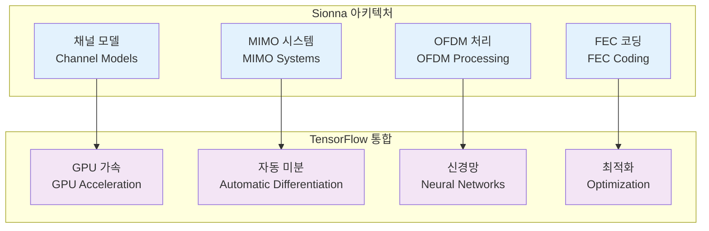
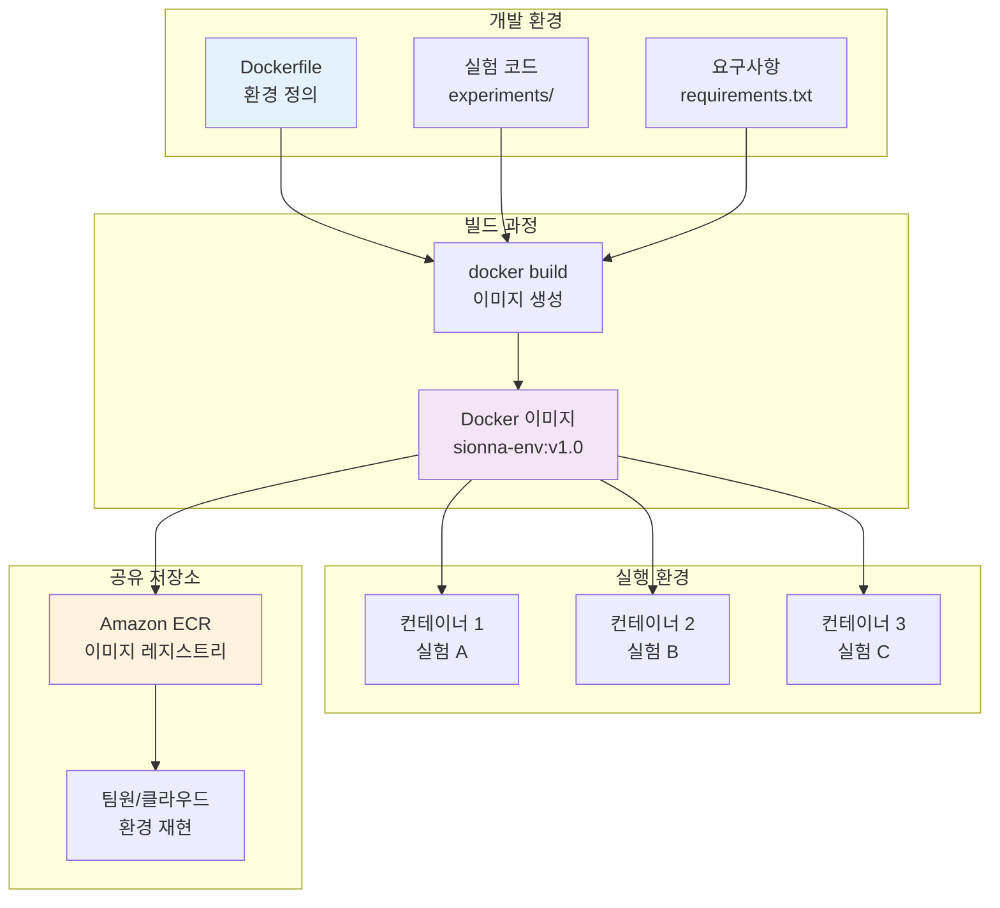
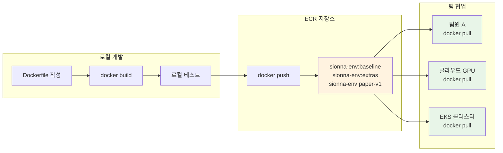

# Sionna 개념 소개

**GPU 가속 6G 연구를 위한 재현 가능한 환경**

NVIDIA Sionna는 6G 무선 통신 연구를 위한 오픈소스 Python 라이브러리입니다. TensorFlow 기반으로 구축되어 GPU 가속을 통한 대규모 링크 레벨 시뮬레이션을 지원합니다. 이 섹션에서는 Sionna의 핵심 개념과 Docker를 통한 환경 격리의 필요성을 학습합니다.

## 🔬 NVIDIA Sionna 라이브러리 개요

### Sionna란 무엇인가?

NVIDIA Sionna는 6G 무선 통신 연구를 위한 오픈소스 Python 라이브러리입니다:

- **링크 레벨 시뮬레이션**: 물리 계층 통신 시스템 모델링
- **TensorFlow 기반**: 딥러닝과 통신 시뮬레이션의 통합
- **GPU 가속**: 대규모 시뮬레이션을 위한 병렬 처리
- **연구 중심**: 학술 연구 및 프로토타이핑에 최적화

### 주요 구성 요소



### 6G 연구에서의 활용

| 연구 영역 | Sionna 활용 | 예시 |
|-----------|-------------|------|
| **채널 모델링** | 3GPP 표준 채널 구현 | 5G NR, 6G 후보 채널 |
| **MIMO 기술** | 대규모 MIMO 시뮬레이션 | Massive MIMO, Cell-free |
| **AI 통신** | 딥러닝 기반 수신기 | Neural receiver, End-to-end |
| **성능 분석** | BER/BLER 시뮬레이션 | 링크 레벨 성능 평가 |

## 📚 Sionna 실험 환경과 컨테이너

### 전통적인 Sionna 환경 설정의 문제점

**로컬 설치 방식의 한계:**

```bash
# 전통적인 방식 - 문제 발생 가능
pip install tensorflow-gpu==2.13.0
pip install sionna
python my_experiment.py  # 내 환경에서만 동작?
```

**주요 문제점:**
- 🚫 **버전 충돌**: TensorFlow, CUDA, Python 버전 불일치
- 🚫 **환경 의존성**: 개발자마다 다른 시스템 환경
- 🚫 **재현성 부족**: "내 컴퓨터에서는 잘 되는데..." 문제
- 🚫 **배포 어려움**: 연구 결과 공유 시 환경 재구성 필요

### Docker를 통한 Sionna 환경 표준화

**컨테이너 기반 접근법:**

```dockerfile
# Dockerfile - 환경을 코드로 정의
FROM tensorflow/tensorflow:2.13.0-gpu
RUN pip install sionna==0.16.0
COPY experiments/ /workspace/
CMD ["python", "my_experiment.py"]
```

```bash
# 누구나 동일한 환경에서 실행
docker build -t sionna-env:v1.0 .
docker run --gpus all sionna-env:v1.0
```

**Docker 솔루션의 장점:**

| 문제점 | Docker 솔루션 |
|--------|---------------|
| 버전 충돌 | Dockerfile에 정확한 버전 명시 |
| 환경 의존성 | 컨테이너 내 완전 격리 |
| 재현성 부족 | 동일 이미지로 100% 재현 |
| 배포 어려움 | ECR 통해 이미지 공유 |

### Sionna 연구 환경 구성 요소

완전한 Sionna 연구 환경은 다음 구성 요소들이 하나의 실행 단위로 통합됩니다:

**핵심 런타임 환경:**
- **Python**: 3.10+ (Sionna 호환성)
- **TensorFlow**: 2.13.0-gpu (GPU 가속 지원)
- **CUDA**: 11.8+ (GPU 연산 라이브러리)

**Sionna 생태계:**
- **sionna**: >=0.16 (핵심 라이브러리)
- **채널 모델**: AWGN, Rayleigh, 3GPP 채널
- **FEC 코딩**: LDPC5G, Polar, Turbo
- **MIMO 처리**: 대규모 MIMO, 빔포밍

**연구 도구:**
- **JupyterLab**: 대화형 실험 환경
- **matplotlib/plotly**: 시각화 도구
- **pandas**: 데이터 분석
- **tensorboard**: 학습 모니터링

**예제 스크립트:**
```
experiments/
├── link_awgn.py          # AWGN 채널 BER 분석
├── mimo_ber.py           # MIMO 시스템 성능
├── ldpc_performance.py   # LDPC 코딩 성능
└── neural_receiver.py    # AI 기반 수신기
```

Dockerfile로 정의하면 이 전체 환경이 "코드화"되어 완벽하게 재현 가능합니다.

## 🐳 왜 Docker로 Sionna를 격리하는가?

### 연구 환경의 Pain Points와 해결책

| 연구 Pain Point | 기존 방식의 문제 | Docker + Sionna 솔루션 |
|-----------------|------------------|------------------------|
| **버전 충돌** | TF 2.13 vs 2.16 충돌로 실험 실패 | `FROM tensorflow:2.13.0-gpu`로 버전 고정 |
| **환경 재구성** | GPU 서버 설정에 2-3시간 소요 | `docker pull` 후 즉시 실행 (5분) |
| **실험 추적** | 어떤 환경에서 결과가 나왔는지 기억 어려움 | `sionna-env:baseline` 태그로 메타데이터화 |
| **협업 문제** | 연구자별 패키지 충돌 | 컨테이너 격리로 완전 독립 실행 |
| **재현성** | "내 컴퓨터에서는 되는데..." | 동일 이미지로 100% 재현 보장 |

### 구체적인 시나리오 예시

**시나리오 1: 논문 재현 실험**
```bash
# 기존 방식 - 실패 가능성 높음
git clone paper-repo
pip install -r requirements.txt  # 버전 충돌 발생
python reproduce_results.py      # 환경 차이로 다른 결과

# Docker 방식 - 100% 재현
docker pull paper-repo/sionna-env:paper-v1
docker run --gpus all paper-repo/sionna-env:paper-v1
# 논문과 동일한 결과 보장
```

**시나리오 2: 다중 연구자 협업**
```bash
# 연구자 A: baseline 환경에서 실험
docker run --name exp-a sionna-env:baseline python experiment_a.py

# 연구자 B: extras 환경에서 실험 (A와 격리됨)
docker run --name exp-b sionna-env:extras python experiment_b.py

# 서로 영향 없이 독립적으로 실행
```

## 🏗️ Sionna + Docker 아키텍처

### 전체 시스템 구조



### 컨테이너 실행 구조 상세

```
┌─────────────────────────────────────────────────────────────────┐
│ Sionna 컨테이너 (실행 중인 실험 환경)                            │
│                                                                 │
│ ┌─────────────┐ ┌─────────────┐ ┌─────────────┐                │
│ │ Python 3.10 │ │ TF 2.13 GPU │ │ sionna 0.16 │                │
│ └─────────────┘ └─────────────┘ └─────────────┘                │
│                                                                 │
│ ┌─────────────────────────────────────────────────────────────┐ │
│ │ 실험 스크립트                                                │ │
│ │ ├── awgn_ber.py        (AWGN 채널 BER 분석)                │ │
│ │ ├── mimo_capacity.py   (MIMO 용량 계산)                    │ │
│ │ └── neural_rx.py       (AI 수신기 학습)                    │ │
│ └─────────────────────────────────────────────────────────────┘ │
│                                                                 │
│ ┌─────────────────────────────────────────────────────────────┐ │
│ │ 분석 도구                                                    │ │
│ │ ├── JupyterLab         (대화형 실험)                        │ │
│ │ ├── matplotlib         (그래프 생성)                        │ │
│ │ └── tensorboard        (학습 모니터링)                      │ │
│ └─────────────────────────────────────────────────────────────┘ │
└─────────────────────────────────────────────────────────────────┘
                              ▲
                    Dockerfile로 정의됨
                              ▼
┌─────────────────────────────────────────────────────────────────┐
│ Docker 이미지 (sionna-env:baseline)                             │
│ - 불변 환경 스냅샷                                               │
│ - ECR에 저장 가능                                               │
│ - 언제든 동일한 컨테이너 생성                                    │
└─────────────────────────────────────────────────────────────────┘
```

**핵심 개념:**
- **이미지**: Sionna 환경의 불변 스냅샷 (템플릿)
- **컨테이너**: 이미지의 실행 인스턴스 (실제 실험 환경)
- **Dockerfile**: 이미지 빌드 레시피 (환경 정의 코드)

## 🧱 Dockerfile 레이어 구조와 최적화

### Sionna 환경 빌드 레이어

효율적인 Sionna 환경 구축을 위한 레이어 구조:

```dockerfile
# 레이어 구조 (아래부터 위로 빌드)
┌─────────────────────────────────────────────────────────────┐
│ Layer 5: COPY experiments/ /workspace/                      │ ← 자주 변경
│         (실험 스크립트 - 개발 중 수정)                        │
├─────────────────────────────────────────────────────────────┤
│ Layer 4: RUN pip install matplotlib pandas tensorboard     │ ← 가끔 변경
│         (분석 도구 - 기능 추가 시)                           │
├─────────────────────────────────────────────────────────────┤
│ Layer 3: RUN pip install sionna==0.16.0                    │ ← 버전업 시
│         (Sionna 라이브러리)                                  │
├─────────────────────────────────────────────────────────────┤
│ Layer 2: RUN apt-get update && apt-get install git htop    │ ← 거의 불변
│         (시스템 도구)                                        │
├─────────────────────────────────────────────────────────────┤
│ Layer 1: FROM tensorflow/tensorflow:2.13.0-gpu             │ ← 불변
│         (GPU 베이스 이미지)                                  │
└─────────────────────────────────────────────────────────────┘
```

### 레이어 캐싱 최적화 전략

**효율적인 Dockerfile 작성:**

```dockerfile
# ❌ 비효율적 - 코드 변경 시 전체 재빌드
FROM tensorflow/tensorflow:2.13.0-gpu
COPY experiments/ /workspace/          # 자주 변경되는 파일을 먼저
RUN pip install sionna matplotlib      # 매번 재설치

# ✅ 효율적 - 레이어 캐싱 활용
FROM tensorflow/tensorflow:2.13.0-gpu
RUN apt-get update && apt-get install -y git htop
RUN pip install sionna==0.16.0         # 버전 고정으로 캐시 활용
RUN pip install matplotlib pandas tensorboard
COPY experiments/ /workspace/          # 자주 변경되는 파일을 마지막에
```

**빌드 시간 비교:**
- 첫 빌드: 15분 (모든 레이어 생성)
- 코드만 수정 후 재빌드: 30초 (Layer 5만 재생성)
- Sionna 버전 업데이트: 5분 (Layer 3-5 재생성)

## 🏷️ 이미지 버전 관리 전략

### Sionna 실험 태깅 패턴

체계적인 태깅으로 실험 환경을 효과적으로 관리:

| 태그 패턴 | 구성 요소 | 사용 목적 | 예시 명령어 |
|-----------|-----------|-----------|-------------|
| **baseline** | sionna + 기본 도구 | 표준 링크 레벨 실험 | `docker run sionna-env:baseline` |
| **extras** | + JupyterLab + 시각화 | 대화형 분석 환경 | `docker run -p 8888:8888 sionna-env:extras` |
| **날짜 기반** | YYYYMMDD 형식 | 워크숍/세미나용 | `docker run sionna-env:20260108` |
| **연구 기반** | 논문/프로젝트명 | 재현 가능한 연구 | `docker run sionna-env:paper-mimo-v1` |

### 태깅 전략의 장점

**1. 실험 추적성**
```bash
# 어떤 환경에서 결과가 나왔는지 명확
docker run sionna-env:baseline python awgn_ber.py
# 결과: "이 BER 곡선은 baseline 환경에서 생성됨"
```

**2. 환경 비교**
```bash
# 같은 실험을 다른 환경에서 비교
docker run sionna-env:baseline python experiment.py > results_baseline.txt
docker run sionna-env:extras python experiment.py > results_extras.txt
diff results_baseline.txt results_extras.txt
```

**3. 버전 롤백**
```bash
# 문제 발생 시 이전 버전으로 즉시 복구
docker run sionna-env:v1.0  # 안정 버전
docker run sionna-env:v1.1  # 새 버전에서 문제 발생
docker run sionna-env:v1.0  # 즉시 롤백
```

### 실제 연구 시나리오

**시나리오: MIMO 성능 비교 연구**

```bash
# 1단계: 기본 환경에서 실험
docker build -t mimo-research:baseline .
docker run mimo-research:baseline python mimo_basic.py

# 2단계: 고급 알고리즘 추가
# Dockerfile에 새 패키지 추가 후
docker build -t mimo-research:advanced .
docker run mimo-research:advanced python mimo_advanced.py

# 3단계: 논문 제출용 최종 버전
docker build -t mimo-research:paper-final .
docker push ecr-repo/mimo-research:paper-final
```

## ☁️ ECR을 통한 환경 공유

### 재현 가능한 연구 워크플로우



### ECR 활용 실습 명령어

**1. ECR 저장소 생성 및 설정**

```bash
# ECR 저장소 생성
aws ecr create-repository \
    --repository-name sionna-env \
    --region ap-northeast-2

# Docker 로그인
# Get account ID automatically
export ACCOUNT_ID=$(aws sts get-caller-identity --query Account --output text)

aws ecr get-login-password --region ap-northeast-2 | \
    docker login --username AWS --password-stdin \
    $ACCOUNT_ID.dkr.ecr.ap-northeast-2.amazonaws.com
```

**2. 이미지 태깅 및 업로드**

```bash
# 로컬 이미지에 ECR 태그 추가
docker tag sionna-env:baseline \
    $ACCOUNT_ID.dkr.ecr.ap-northeast-2.amazonaws.com/sionna-env:baseline

# ECR에 업로드
docker push $ACCOUNT_ID.dkr.ecr.ap-northeast-2.amazonaws.com/sionna-env:baseline

# 여러 태그 동시 업로드
docker tag sionna-env:extras \
    $ACCOUNT_ID.dkr.ecr.ap-northeast-2.amazonaws.com/sionna-env:extras
docker push $ACCOUNT_ID.dkr.ecr.ap-northeast-2.amazonaws.com/sionna-env:extras
```

**3. 다른 환경에서 사용**

```bash
# 팀원이 다른 서버에서 사용
docker pull $ACCOUNT_ID.dkr.ecr.ap-northeast-2.amazonaws.com/sionna-env:baseline
docker run --gpus all \
    $ACCOUNT_ID.dkr.ecr.ap-northeast-2.amazonaws.com/sionna-env:baseline \
    python experiment.py
```

### 협업 시나리오 예시

**연구팀 협업 워크플로우:**

```bash
# 연구 리더: 표준 환경 정의 및 공유
docker build -t sionna-env:team-standard .
docker push ecr-repo/sionna-env:team-standard

# 팀원 1: GPU 클러스터에서 대규모 실험
ssh gpu-cluster
docker pull ecr-repo/sionna-env:team-standard
docker run --gpus all ecr-repo/sionna-env:team-standard python large_scale_sim.py

# 팀원 2: 로컬에서 알고리즘 개발
docker pull ecr-repo/sionna-env:team-standard
docker run -v $(pwd):/workspace ecr-repo/sionna-env:team-standard python dev_algorithm.py

# 논문 제출: 재현 가능한 환경 공개
docker push ecr-repo/sionna-env:paper-2026-mimo
# 리뷰어가 동일한 환경에서 결과 검증 가능
```

## 🔄 패러다임 전환: 환경 설치 → 환경 정의

### 기존 방식 vs Docker 방식

**과거: 수동 환경 설정**
```bash
# 매번 반복되는 수동 작업
sudo apt update
sudo apt install python3-pip
pip install tensorflow-gpu==2.13.0  # 버전 충돌 가능성
pip install sionna                   # 의존성 문제 발생 가능
python awgn_experiment.py           # "내 환경에서만 동작"
```

**현재: 선언적 환경 정의**
```dockerfile
# Dockerfile - 환경을 코드로 정의
FROM tensorflow/tensorflow:2.13.0-gpu
RUN pip install sionna==0.16.0 matplotlib pandas
COPY experiments/ /workspace/
WORKDIR /workspace
CMD ["python", "awgn_experiment.py"]
```

```bash
# 한 번 정의하면 어디서나 동일하게 실행
docker build -t sionna-env:v1.0 .
docker run --gpus all sionna-env:v1.0  # 누구나 동일한 결과
```

### 사고방식의 변화

| 측면 | 기존 사고방식 | Docker 사고방식 |
|------|---------------|-----------------|
| **환경 관리** | "환경을 설치한다" | "환경을 정의한다" |
| **문제 해결** | "내 컴퓨터에서 고쳐보자" | "Dockerfile에서 수정하자" |
| **공유 방식** | "설치 가이드 문서 작성" | "이미지 공유" |
| **재현성** | "최대한 비슷하게 설정" | "100% 동일한 환경" |
| **버전 관리** | "메모장에 기록" | "Git + 태그로 관리" |

### 워크숍 목표: 습관 변화

**Before (환경 설정 중심):**
```bash
# 새 프로젝트 시작 시
mkdir new_project
cd new_project
pip install tensorflow sionna  # 매번 새로 설치
python experiment.py
```

**After (환경 정의 중심):**
```bash
# 새 프로젝트 시작 시
mkdir new_project
cd new_project
# Dockerfile 작성 (환경 정의)
cat > Dockerfile << EOF
FROM tensorflow/tensorflow:2.13.0-gpu
RUN pip install sionna==0.16.0
COPY . /workspace
WORKDIR /workspace
EOF

docker build -t my-project:v1.0 .
docker run --gpus all my-project:v1.0 python experiment.py
```

**핵심 변화:**
- ✅ 환경 설정 → 환경 정의 (코드화)
- ✅ 수동 설치 → 자동 빌드 (재현성)
- ✅ 개인 환경 → 공유 환경 (협업)
- ✅ 문서 기록 → 코드 기록 (정확성)

## 📝 핵심 개념 정리

### 학습 내용 체크리스트

✅ **Sionna 라이브러리 이해**
- 6G 연구를 위한 GPU 가속 시뮬레이션 라이브러리
- TensorFlow 기반 딥러닝 통합 환경
- 링크 레벨 시뮬레이션의 핵심 도구

✅ **Docker 격리의 필요성**
- 버전 충돌 해결 및 재현성 보장
- 연구자 간 환경 표준화
- 협업 및 결과 공유 효율성

✅ **컨테이너 아키텍처**
- 이미지 vs 컨테이너 개념 구분
- Dockerfile 레이어 구조 이해
- 효율적인 빌드 전략

✅ **버전 관리 전략**
- 태깅을 통한 환경 추적
- baseline/extras 환경 구분
- 연구 단계별 버전 관리

✅ **ECR 활용**
- 클라우드 기반 이미지 공유
- 팀 협업 워크플로우
- 재현 가능한 연구 환경 구축

### 다음 단계 준비

이제 개념을 이해했으니, 실제로 Sionna Dockerfile을 작성하고 컨테이너를 빌드해보겠습니다. 다음 섹션에서는:

1. **Dockerfile 템플릿 작성**: Sionna 환경 정의
2. **이미지 빌드 실습**: 실제 컨테이너 생성
3. **GPU 환경 검증**: Sionna 예제 실행
4. **태깅 및 관리**: 버전별 이미지 관리

## 🚀 다음 단계

제공된 Dockerfile 템플릿으로 Sionna 이미지를 직접 빌드하고 실행해보겠습니다.

---

**[Dockerfile과 Sionna 실습으로 계속 →](/40-container-environment/docker-and-sionna/)**