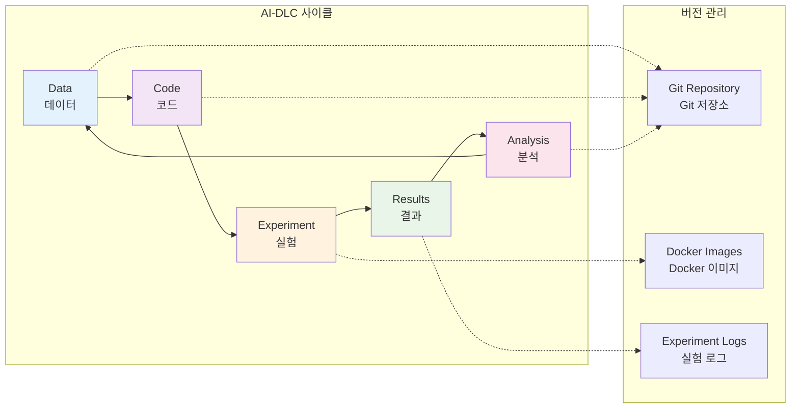

# Git 사용을 통한 버전 관리

**AI-DLC 기반 실험 코드 관리**

컨테이너 기반 실험 환경을 구축했다면, 이제 체계적인 버전 관리가 필요합니다. 이 모듈에서는 Git을 활용하여 AI-DLC(Development Life Cycle) 개념을 바탕으로 한 실험 버전 관리 시스템을 구축하는 방법을 학습합니다.

## 🎯 학습 목표

이 모듈을 완료하면 다음을 할 수 있습니다:

- AI-DLC(Development Life Cycle) 개념과 실험 재현성 중요성 이해
- Git 저장소 초기화 및 기본 명령어 활용
- .gitignore 파일을 통한 효율적인 버전 관리

## 🔄 AI-DLC 개념과 실험 재현성

### AI-DLC(Development Life Cycle)란?

AI-DLC는 AI/ML 연구에서 데이터, 코드, 실험 결과의 전체 생명주기를 관리하는 방법론입니다:



### 실험 재현성의 중요성

통신 연구에서 실험 재현성이 중요한 이유:

- **연구 검증**: 동일한 조건에서 동일한 결과 보장
- **협업 효율성**: 팀원 간 실험 환경 공유
- **점진적 개선**: 이전 실험을 기반으로 한 발전
- **논문 작성**: 재현 가능한 결과로 신뢰성 확보

## 🚀 Git 저장소 초기화

### 저장소 생성 및 초기 설정

```bash
# 프로젝트 디렉터리 생성
mkdir sionna-experiments
cd sionna-experiments

# Git 저장소 초기화
git init

# 기본 브랜치를 main으로 설정
git branch -M main

# 사용자 정보 설정 (전역 설정이 없는 경우)
git config user.name "Your Name"
git config user.email "your.email@example.com"
```

### 기본 파일 생성

**README.md 파일:**

```markdown
# Sionna Experiments

NVIDIA Sionna를 활용한 통신 시스템 시뮬레이션 실험 프로젝트

## 프로젝트 개요

이 프로젝트는 5G/6G 통신 시스템 연구를 위한 Sionna 기반 실험 환경을 제공합니다.

## 환경 설정

### Docker 사용

```bash
docker-compose up -d
```

### 로컬 환경

```bash
pip install -r requirements.txt
```

## 실험 실행

### 기본 실험

```bash
python experiments/baseline/awgn_simulation.py
```

## 프로젝트 구조

- `src/`: 소스 코드
- `experiments/`: 실험 스크립트
- `notebooks/`: Jupyter 노트북
- `results/`: 실험 결과
- `data/`: 데이터 파일

## 기여 방법

1. Fork the repository
2. Create a feature branch
3. Make your changes
4. Submit a pull request
```

## 📝 .gitignore 파일 구성

- 보안에 민감한 파일, 버전 관리에 용량이 큰 파일 등을 포함하지 않는 것이 좋습니다.

### 효율적인 .gitignore 설정 (예시)

```gitignore
# Python
__pycache__/
*.py[cod]
*$py.class
*.so
.Python
build/
develop-eggs/
dist/
downloads/
eggs/
.eggs/
lib/
lib64/
parts/
sdist/
var/
wheels/
*.egg-info/
.installed.cfg
*.egg

# Jupyter Notebook
.ipynb_checkpoints
*/.ipynb_checkpoints/*

# IPython
profile_default/
ipython_config.py

# Environment variables
.env
.venv
env/
venv/
ENV/
env.bak/
venv.bak/

# IDE
.vscode/
.idea/
*.swp
*.swo
*~

# OS
.DS_Store
.DS_Store?
._*
.Spotlight-V100
.Trashes
ehthumbs.db
Thumbs.db

# Data files (large files)
data/raw/*.csv
data/raw/*.h5
data/raw/*.hdf5
data/processed/*.pkl
data/processed/*.pickle

# Results (선택적으로 추가)
results/models/*.h5
results/models/*.pb
results/logs/train/
results/logs/validation/

# Temporary files
*.tmp
*.temp
*.log

# Docker
.dockerignore

# Conda
.conda/
```

## 🔧 Git 기본 워크플로우

### 일반적인 Git 명령어

```bash
# 파일 상태 확인
git status

# 변경사항 스테이징
git add .
git add src/models/new_model.py

# 커밋 생성
git commit -m "Add new MIMO channel model implementation"

# 원격 저장소 추가
git remote add origin https://github.com/username/sionna-experiments.git

# 변경사항 푸시
git push -u origin main

# 변경사항 풀
git pull origin main

# 브랜치 생성 및 전환
git checkout -b feature/new-experiment
git switch feature/new-experiment

# 브랜치 병합
git checkout main
git merge feature/new-experiment

# 로그 확인
git log --oneline --graph
```

### 실험 중심 커밋 전략

```bash
# 실험 설정 커밋
git add experiments/mimo_systems/config.py
git commit -m "Configure MIMO system parameters for 64x64 antenna array"

# 실험 실행 스크립트 커밋
git add experiments/mimo_systems/run_simulation.py
git commit -m "Implement MIMO simulation with Sionna channel models"

# 결과 분석 커밋
git add notebooks/results/mimo_analysis.ipynb
git commit -m "Analyze MIMO performance results and generate plots"

# 문서 업데이트 커밋
git add README.md docs/mimo_experiments.md
git commit -m "Update documentation for MIMO experiments"
```

## 🌿 브랜치 전략

### 실험 중심 브랜치 구조

```bash
# 메인 브랜치
main                    # 안정적인 실험 환경

# 기능 브랜치
feature/channel-models  # 새로운 채널 모델 구현
feature/mimo-systems   # MIMO 시스템 실험
feature/optimization   # 최적화 알고리즘

# 실험 브랜치
experiment/baseline-v1  # 기준 실험 버전 1
experiment/mimo-64x64  # 64x64 MIMO 실험
experiment/ldpc-codes  # LDPC 코드 실험

# 릴리스 브랜치
release/v1.0           # 첫 번째 릴리스
release/v1.1           # 버그 수정 릴리스
```

### 브랜치 생성 및 관리

```bash
# 새로운 실험 브랜치 생성
git checkout -b experiment/mimo-performance
git push -u origin experiment/mimo-performance

# 실험 완료 후 메인 브랜치로 병합
git checkout main
git merge experiment/mimo-performance
git push origin main

# 실험 브랜치 정리
git branch -d experiment/mimo-performance
git push origin --delete experiment/mimo-performance
```

## 📝 정리

이 모듈에서 학습한 내용:

✅ **AI-DLC 개념 이해**
- 데이터-코드-생명주기 관리 방법론
- 실험 재현성의 중요성과 구현 방법

✅ **Git 버전 관리**
- 저장소 초기화 및 기본 명령어
- 실험 중심 커밋 전략

✅ **효율적인 파일 관리**
- .gitignore를 통한 선택적 버전 관리
- 보안에 민감한 파일, 대용량 파일 및 임시 파일 제외

## 🚀 다음 단계

다음 모듈에서는 Sionna를 예시로 git를 활용한 통합 실험 환경과 팀 단위 실험 공유 워크플로우를 학습합니다. 실험 변경사항 추적과 재현성을 보장하는 협업 중심의 워크플로우를 구축해보겠습니다.

---

**[통합 워크플로우로 계속 →](/60-integrated-workflow/)**