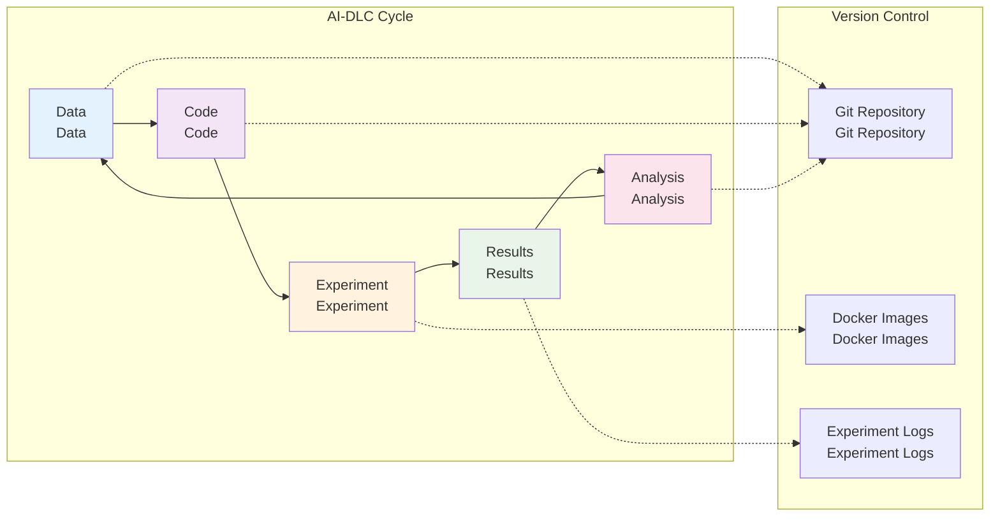

# Version Management Using Git

**AI-DLC Based Experiment Code Management**

Having built container-based experiment environments, systematic version management is now essential. In this module, you'll learn how to build an experiment version management system using Git based on AI-DLC (Development Life Cycle) concepts.

## 🎯 Learning Objectives

After completing this module, you will be able to:

- Understand AI-DLC (Development Life Cycle) concepts and experiment reproducibility importance
- Initialize Git repositories and utilize basic commands
- Implement efficient version management through .gitignore files

## 🔄 AI-DLC Concepts and Experiment Reproducibility

### What is AI-DLC (Development Life Cycle)?

AI-DLC is a methodology for managing the entire lifecycle of data, code, and experiment results in AI/ML research:



### Importance of Experiment Reproducibility

Why experiment reproducibility is crucial in communication research:

- **Research Validation**: Ensuring identical results under identical conditions
- **Collaboration Efficiency**: Sharing experiment environments among team members
- **Incremental Improvement**: Building upon previous experiments
- **Paper Writing**: Establishing credibility with reproducible results

## 🚀 Git Repository Initialization

### Repository Creation and Initial Setup

```bash
# Create project directory
mkdir sionna-experiments
cd sionna-experiments

# Initialize Git repository
git init

# Set default branch to main
git branch -M main

# Set user information (if not configured globally)
git config user.name "Your Name"
git config user.email "your.email@example.com"
```

### Create Basic Files

**README.md file:**

```markdown
# Sionna Experiments

Communication system simulation experiment project using NVIDIA Sionna

## Project Overview

This project provides a Sionna-based experiment environment for 5G/6G communication system research.

## Environment Setup

### Using Docker

```bash
docker-compose up -d
```

### Local Environment

```bash
pip install -r requirements.txt
```

## Running Experiments

### Basic Experiment

```bash
python experiments/baseline/awgn_simulation.py
```

## Project Structure

- `src/`: Source code
- `experiments/`: Experiment scripts
- `notebooks/`: Jupyter notebooks
- `results/`: Experiment results
- `data/`: Data files

## Contributing

1. Fork the repository
2. Create a feature branch
3. Make your changes
4. Submit a pull request
```

## 📝 .gitignore File Configuration

It's recommended to exclude security-sensitive files, large files, and other files that shouldn't be version controlled.

### Efficient .gitignore Setup (Example)

```gitignore
# Python
__pycache__/
*.py[cod]
*$py.class
*.so
.Python
build/
develop-eggs/
dist/
downloads/
eggs/
.eggs/
lib/
lib64/
parts/
sdist/
var/
wheels/
*.egg-info/
.installed.cfg
*.egg

# Jupyter Notebook
.ipynb_checkpoints
*/.ipynb_checkpoints/*

# IPython
profile_default/
ipython_config.py

# Environment variables
.env
.venv
env/
venv/
ENV/
env.bak/
venv.bak/

# IDE
.vscode/
.idea/
*.swp
*.swo
*~

# OS
.DS_Store
.DS_Store?
._*
.Spotlight-V100
.Trashes
ehthumbs.db
Thumbs.db

# Data files (large files)
data/raw/*.csv
data/raw/*.h5
data/raw/*.hdf5
data/processed/*.pkl
data/processed/*.pickle

# Results (selectively add)
results/models/*.h5
results/models/*.pb
results/logs/train/
results/logs/validation/

# Temporary files
*.tmp
*.temp
*.log

# Docker
.dockerignore

# Conda
.conda/
```

## 🔧 Basic Git Workflow

### Common Git Commands

```bash
# Check file status
git status

# Stage changes
git add .
git add src/models/new_model.py

# Create commit
git commit -m "Add new MIMO channel model implementation"

# Add remote repository
git remote add origin https://github.com/username/sionna-experiments.git

# Push changes
git push -u origin main

# Pull changes
git pull origin main

# Create and switch branch
git checkout -b feature/new-experiment
git switch feature/new-experiment

# Merge branch
git checkout main
git merge feature/new-experiment

# Check log
git log --oneline --graph
```

### Experiment-Focused Commit Strategy

```bash
# Commit experiment configuration
git add experiments/mimo_systems/config.py
git commit -m "Configure MIMO system parameters for 64x64 antenna array"

# Commit experiment execution script
git add experiments/mimo_systems/run_simulation.py
git commit -m "Implement MIMO simulation with Sionna channel models"

# Commit results analysis
git add notebooks/results/mimo_analysis.ipynb
git commit -m "Analyze MIMO performance results and generate plots"

# Commit documentation update
git add README.md docs/mimo_experiments.md
git commit -m "Update documentation for MIMO experiments"
```

## 🌿 Branching Strategy

### Experiment-Focused Branch Structure

```bash
# Main branch
main                    # Stable experiment environment

# Feature branches
feature/channel-models  # New channel model implementation
feature/mimo-systems   # MIMO system experiments
feature/optimization   # Optimization algorithms

# Experiment branches
experiment/baseline-v1  # Baseline experiment version 1
experiment/mimo-64x64  # 64x64 MIMO experiment
experiment/ldpc-codes  # LDPC code experiment

# Release branches
release/v1.0           # First release
release/v1.1           # Bug fix release
```

### Branch Creation and Management

```bash
# Create new experiment branch
git checkout -b experiment/mimo-performance
git push -u origin experiment/mimo-performance

# Merge to main branch after experiment completion
git checkout main
git merge experiment/mimo-performance
git push origin main

# Clean up experiment branch
git branch -d experiment/mimo-performance
git push origin --delete experiment/mimo-performance
```

## 📝 Summary

What you learned in this module:

✅ **Understanding AI-DLC Concepts**
- Data-Code-Lifecycle management methodology
- Importance and implementation of experiment reproducibility

✅ **Git Version Management**
- Repository initialization and basic commands
- Experiment-focused commit strategies

✅ **Efficient File Management**
- Selective version management through .gitignore
- Excluding security-sensitive files, large files, and temporary files

## 🚀 Next Steps

In the next module, you'll learn integrated experiment environments using Sionna as an example with Git and team-based experiment sharing workflows. We'll build collaboration-centered workflows that ensure experiment change tracking and reproducibility.

---

**[Continue to Integrated Workflow →](/60-integrated-workflow/)**