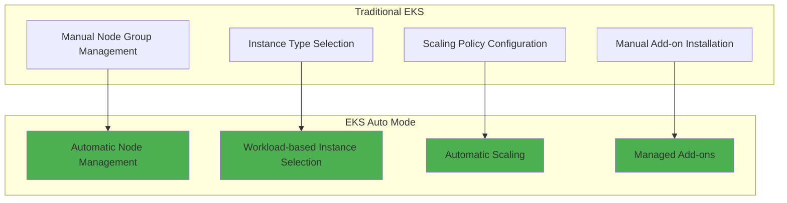

# Sionna Deployment and Scaling on Amazon EKS Auto Mode

**Operating Containerized Research Environments on Existing Clusters**

Learn how to deploy Sionna container images built in previous modules to Amazon EKS Auto Mode clusters and dynamically scale them according to experiment requirements.

## 🎯 Learning Objectives

After completing this section, you will be able to:

- Configure kubeconfig for EKS Auto Mode clusters
- Deploy Sionna images from ECR as Deployments
- Manage pods and services using kubectl
- Perform manual scaling by adjusting Deployment replica counts
- Monitor resources according to experimental workloads

## 🚀 Features of EKS Auto Mode

### Traditional EKS vs EKS Auto Mode



### Key Benefits of Auto Mode

**Fully Managed Computing**
- Automated node provisioning and management
- Automatic selection of instances optimized for workloads
- Automatic recovery in case of failures

**Cost Optimization**
- Automatic release of unused resources
- Optimal instance selection based on workload patterns
- Automatic utilization of Spot instances

## 🔧 Lab 1: EKS Cluster Connection Setup

### 1.1 kubeconfig Configuration

First, configure kubeconfig to connect to the existing EKS Auto Mode cluster.

```bash
# Check EKS cluster list
aws eks list-clusters --region ap-northeast-2

# Update kubeconfig (cluster name: eks-automode)
aws eks update-kubeconfig --region ap-northeast-2 --name eks-automode

# Verify connection
kubectl config current-context
```

### 1.2 Cluster Status Check

```bash
# Check cluster information
kubectl cluster-info

# Check node status (nodes are created after workload deployment in Auto Mode)
kubectl get nodes

# Check namespaces
kubectl get namespaces

# Check default system pods
kubectl get pods --all-namespaces
```

**💡 Note**: In EKS Auto Mode, nodes may not be created until workloads are deployed. This is normal behavior.

## 🐳 Lab 2: Sionna Image Deployment

### 2.1 Namespace Creation

Create a dedicated namespace for the research environment.

```bash
# Create research namespace
kubectl create namespace research

# Verify namespace
kubectl get namespaces
```

### 2.2 ECR Image Information Check

Check the Sionna image pushed to ECR in previous modules.

```bash
# Check ECR repository list
aws ecr describe-repositories --region ap-northeast-2

# Check Sionna image tags
aws ecr list-images --repository-name sionna --region ap-northeast-2

# Check latest image URI (replace account ID with actual value)
echo "676206906668.dkr.ecr.ap-northeast-2.amazonaws.com/sionna:latest"
```

### 2.3 Create Sionna Deployment

Deploy the Sionna research environment as a Kubernetes Deployment.

```bash
# Create Deployment YAML file
cat > sionna-deployment.yaml << 'EOF'
apiVersion: apps/v1
kind: Deployment
metadata:
  name: sionna-research
  namespace: research
  labels:
    app: sionna-research
spec:
  replicas: 2  # Start with 2 pods initially
  selector:
    matchLabels:
      app: sionna-research
  template:
    metadata:
      labels:
        app: sionna-research
    spec:
      containers:
      - name: sionna-lab
        image: 676206906668.dkr.ecr.ap-northeast-2.amazonaws.com/sionna:latest
        ports:
        - containerPort: 8888
          name: jupyter
        resources:
          requests:
            memory: "2Gi"
            cpu: "1"
          limits:
            memory: "4Gi"
            cpu: "2"
        env:
        - name: JUPYTER_ENABLE_LAB
          value: "yes"
        - name: JUPYTER_TOKEN
          value: "sionna-workshop"
        readinessProbe:
          httpGet:
            path: /lab
            port: 8888
          initialDelaySeconds: 30
          periodSeconds: 10
        livenessProbe:
          httpGet:
            path: /lab
            port: 8888
          initialDelaySeconds: 60
          periodSeconds: 30
EOF

# Deploy Deployment
kubectl apply -f sionna-deployment.yaml
```

### 2.4 Check Deployment Status

```bash
# Check Deployment status
kubectl get deployments -n research

# Check pod status
kubectl get pods -n research

# Check pod details
kubectl describe pods -n research

# Check pod logs (replace pod name with actual value)
kubectl logs -n research -l app=sionna-research
```

## 🌐 Lab 3: Service Creation and Access

### 3.1 Create LoadBalancer Service

Create a LoadBalancer service to enable external access to Sionna Jupyter Lab.

```bash
# Create Service YAML file
cat > sionna-service.yaml << 'EOF'
apiVersion: v1
kind: Service
metadata:
  name: sionna-service
  namespace: research
  labels:
    app: sionna-research
spec:
  type: LoadBalancer
  selector:
    app: sionna-research
  ports:
  - name: jupyter
    port: 8888
    targetPort: 8888
    protocol: TCP
  annotations:
    service.beta.kubernetes.io/aws-load-balancer-type: "nlb"
    service.beta.kubernetes.io/aws-load-balancer-scheme: "internet-facing"
EOF

# Deploy service
kubectl apply -f sionna-service.yaml
```

### 3.2 Verify Service Access

```bash
# Check service status
kubectl get services -n research

# Check LoadBalancer external IP (takes 2-3 minutes to create)
kubectl get service sionna-service -n research -w

# Check external access URL
EXTERNAL_IP=$(kubectl get service sionna-service -n research -o jsonpath='{.status.loadBalancer.ingress[0].hostname}')
echo "Jupyter Lab URL: http://$EXTERNAL_IP:8888"
echo "Token: sionna-workshop"
```

**💡 Access Method**: Access the above URL in your browser and enter `sionna-workshop` as the token.

## 📊 Lab 4: Manual Scaling Practice

### 4.1 Check Current Pod Count

```bash
# Check current running pod count
kubectl get pods -n research -l app=sionna-research

# Check Deployment details
kubectl describe deployment sionna-research -n research
```

### 4.2 Scale Up (Increase Pod Count)

Assume research experiments have increased and scale up the pod count.

```bash
# Increase pod count to 5
kubectl scale deployment sionna-research --replicas=5 -n research

# Monitor scaling progress in real-time
kubectl get pods -n research -l app=sionna-research -w

# Check the process of new pods being created
kubectl get events -n research --sort-by='.lastTimestamp'
```

### 4.3 Check Automatic Node Provisioning

Check automatic node creation in EKS Auto Mode as workload increases.

```bash
# Check node status (new nodes are automatically added)
kubectl get nodes

# Check pod placement by node
kubectl get pods -n research -o wide

# Check cluster resource usage
kubectl top nodes
kubectl top pods -n research
```

### 4.4 Scale Down (Decrease Pod Count)

Assume experiments are completed and reduce the pod count.

```bash
# Decrease pod count to 1
kubectl scale deployment sionna-research --replicas=1 -n research

# Check pod termination process
kubectl get pods -n research -l app=sionna-research -w

# Check resource usage changes
kubectl top pods -n research
```

## 🔍 Lab 5: Pod and Log Monitoring

### 5.1 Pod Status Monitoring

```bash
# Real-time pod status monitoring
watch kubectl get pods -n research

# Pod resource usage monitoring
watch kubectl top pods -n research

# Check specific pod details
POD_NAME=$(kubectl get pods -n research -l app=sionna-research -o jsonpath='{.items[0].metadata.name}')
kubectl describe pod $POD_NAME -n research
```

### 5.2 Log Monitoring

```bash
# Check logs from all Sionna pods
kubectl logs -n research -l app=sionna-research

# Real-time log monitoring for specific pod
kubectl logs -f $POD_NAME -n research

# Check logs from previously restarted pods (if any)
kubectl logs $POD_NAME -n research --previous
```

### 5.3 Pod Internal Access

```bash
# Access pod internal shell
kubectl exec -it $POD_NAME -n research -- /bin/bash

# Check Sionna environment inside pod
kubectl exec $POD_NAME -n research -- python -c "import sionna; print(sionna.__version__)"

# Check pod internal file system
kubectl exec $POD_NAME -n research -- ls -la /workspace
```

## 📈 Lab 6: Experiment Simulation

### 6.1 Multi-Experiment Environment Simulation

Assume multiple researchers are conducting experiments simultaneously and scale pods.

```bash
# Scale pods for 5 researchers
kubectl scale deployment sionna-research --replicas=5 -n research

# Check access information for each pod
kubectl get pods -n research -l app=sionna-research -o wide

# Check traffic distribution through load balancer
for i in {1..10}; do
  curl -s http://$EXTERNAL_IP:8888/lab | grep -o "Jupyter" || echo "Request $i"
  sleep 1
done
```

### 6.2 Resource Usage Pattern Analysis

```bash
# Check CPU and memory usage by pod
kubectl top pods -n research --sort-by=cpu

# Check resource usage by node
kubectl top nodes --sort-by=cpu

# Check overall cluster resource status
kubectl describe nodes | grep -A 5 "Allocated resources"
```

### 6.3 Cleanup After Experiments

```bash
# Minimize pod count after experiment completion
kubectl scale deployment sionna-research --replicas=1 -n research

# Check unnecessary resource cleanup
kubectl get pods -n research
kubectl get nodes

# Observe automatic node scaling down process in Auto Mode
watch kubectl get nodes
```

## 🛠️ Advanced Lab: Deployment Updates

### 7.1 Rolling Update Simulation

Simulate updating to a new Sionna image version.

```bash
# Check current image version
kubectl describe deployment sionna-research -n research | grep Image

# Update image (change tag to v1.0)
kubectl set image deployment/sionna-research sionna-lab=676206906668.dkr.ecr.ap-northeast-2.amazonaws.com/sionna:v1.0 -n research

# Check rolling update progress
kubectl rollout status deployment/sionna-research -n research

# Check update history
kubectl rollout history deployment/sionna-research -n research
```

### 7.2 Rollback Practice

```bash
# Rollback to previous version
kubectl rollout undo deployment/sionna-research -n research

# Check rollback progress
kubectl rollout status deployment/sionna-research -n research

# Rollback to specific revision
kubectl rollout undo deployment/sionna-research --to-revision=1 -n research
```

## 📊 Performance and Cost Analysis

### EKS Auto Mode vs Traditional Environment Comparison

| Item | Local Docker | EKS Auto Mode | Improvement |
|------|-------------|---------------|-------------|
| Concurrent Experiment Environments | 1 | 5-10 | 5-10x |
| Resource Utilization | Fixed | Dynamic Adjustment | 30-50% efficiency |
| Management Complexity | Manual | Automated | 80% reduction |
| Scalability | Limited | Unlimited | Unlimited |
| Cost | Fixed | Usage-based | 20-40% savings |

### Resource Usage Patterns

```bash
# Resource usage monitoring script by time
cat > monitor-resources.sh << 'EOF'
#!/bin/bash
echo "Timestamp,Pods,CPU_Usage,Memory_Usage" > resource-usage.csv

for i in {1..60}; do
  TIMESTAMP=$(date '+%Y-%m-%d %H:%M:%S')
  PODS=$(kubectl get pods -n research -l app=sionna-research --no-headers | wc -l)
  CPU=$(kubectl top pods -n research -l app=sionna-research --no-headers | awk '{sum+=$2} END {print sum}' | sed 's/m//')
  MEMORY=$(kubectl top pods -n research -l app=sionna-research --no-headers | awk '{sum+=$3} END {print sum}' | sed 's/Mi//')
  
  echo "$TIMESTAMP,$PODS,$CPU,$MEMORY" >> resource-usage.csv
  echo "[$i/60] Pods: $PODS, CPU: ${CPU}m, Memory: ${MEMORY}Mi"
  
  sleep 60
done
EOF

chmod +x monitor-resources.sh
# ./monitor-resources.sh  # Run in background
```

## 🧹 Lab Cleanup

### Resource Cleanup

Clean up resources created after lab completion.

```bash
# Delete Deployment
kubectl delete deployment sionna-research -n research

# Delete Service
kubectl delete service sionna-service -n research

# Delete namespace (optional)
kubectl delete namespace research

# Clean up created YAML files
rm -f sionna-deployment.yaml sionna-service.yaml monitor-resources.sh
```

## 📝 Lab Exercises

### Exercise 1: Basic Deployment and Access
1. Configure kubeconfig for EKS Auto Mode cluster
2. Create Deployment by pulling Sionna image from ECR
3. Verify external access through LoadBalancer service
4. Run simple Sionna code in Jupyter Lab

### Exercise 2: Scaling Practice
1. Scale pod count from 1 to 5
2. Observe automatic node provisioning process
3. Scale pod count back to 1
4. Monitor resource usage changes

### Exercise 3: Advanced Operations
1. Change image version through rolling update
2. Perform rollback in case of update failure
3. Monitor pod logs and status
4. Analyze resource usage patterns

## 🎯 Key Learning Points

### Advantages of EKS Auto Mode
- **Fully Managed**: Automated node management
- **Cost Efficiency**: Usage-based billing
- **Auto Scaling**: Dynamic adjustment based on workload
- **Simplified Operations**: Minimal infrastructure management burden

### Core kubectl Commands
- `kubectl get`: Resource inquiry
- `kubectl describe`: Detailed information check
- `kubectl logs`: Log check
- `kubectl scale`: Scaling
- `kubectl exec`: Pod internal access

### Monitoring and Management
- Real-time pod status monitoring
- Resource usage tracking
- Log-based troubleshooting
- Rolling updates and rollbacks

## 🚀 Next Steps

You have completed Sionna deployment and scaling practice on EKS Auto Mode. Now you can explore the following advanced features:

1. **Auto Scaling**: Configure HPA (Horizontal Pod Autoscaler)
2. **CI/CD Pipeline**: Integrate GitHub Actions with EKS
3. **Enhanced Monitoring**: Build Prometheus + Grafana
4. **Security Enhancement**: Apply RBAC and network policies

---

**[Continue to Workshop Summary →](/80-summary/)**