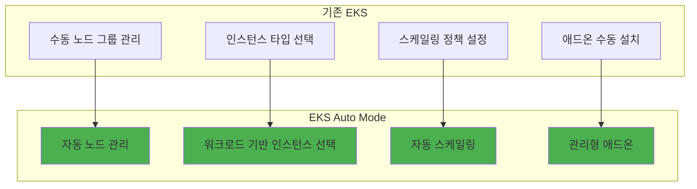

# Amazon EKS Auto Mode에서 Sionna 배포 및 스케일링

**기존 클러스터에서 컨테이너화된 연구 환경 운영**

이전 모듈에서 구축한 Sionna 컨테이너 이미지를 Amazon EKS Auto Mode 클러스터에 배포하고, 실험 규모에 따라 동적으로 스케일링하는 방법을 학습합니다.

## 🎯 학습 목표

이 섹션을 완료하면 다음을 할 수 있습니다:

- EKS Auto Mode 클러스터에 kubeconfig 설정
- ECR에서 Sionna 이미지를 가져와 Deployment로 배포
- kubectl을 사용한 파드 및 서비스 관리
- Deployment 레플리카 수 조정을 통한 수동 스케일링
- 실험 워크로드에 따른 리소스 모니터링

## 🚀 EKS Auto Mode의 특징

### 기존 EKS vs EKS Auto Mode



### Auto Mode의 주요 이점

**완전 관리형 컴퓨팅**
- 노드 프로비저닝 및 관리 자동화
- 워크로드에 최적화된 인스턴스 자동 선택
- 장애 발생 시 자동 복구

**비용 최적화**
- 사용하지 않는 리소스 자동 해제
- 워크로드 패턴에 따른 최적 인스턴스 선택
- Spot 인스턴스 자동 활용

## 🔧 실습 1: EKS 클러스터 연결 설정

### 1.1 kubeconfig 설정

먼저 기존에 생성된 EKS Auto Mode 클러스터에 연결하기 위해 kubeconfig를 설정합니다.

```bash
# kubeconfig 업데이트 (클러스터 이름: eks-automode)
aws eks update-kubeconfig --region ap-northeast-2 --name eks-automode

# EKS 클러스터 목록 확인
aws eks list-clusters --region ap-northeast-2

# 연결 확인
kubectl config current-context
```

### 1.2 클러스터 상태 확인

```bash
# 클러스터 정보 확인
kubectl cluster-info

# 노드 상태 확인 (Auto Mode에서는 워크로드 배포 후 노드가 생성됨)
kubectl get nodes

# 네임스페이스 확인
kubectl get namespaces

# 기본 시스템 파드 확인
kubectl get pods --all-namespaces
```

**💡 참고**: EKS Auto Mode에서는 워크로드를 배포하기 전까지 노드가 생성되지 않을 수 있습니다. 이는 정상적인 동작입니다.

## 🐳 실습 2: Sionna 이미지 배포

### 2.1 네임스페이스 생성

연구 환경을 위한 전용 네임스페이스를 생성합니다.

```bash
# research 네임스페이스 생성
kubectl create namespace research

# 네임스페이스 확인
kubectl get namespaces
```

### 2.2 ECR 이미지 정보 확인

이전 모듈에서 ECR에 푸시한 Sionna 이미지를 확인합니다.

```bash
# ECR 저장소 목록 확인
aws ecr describe-repositories --region ap-northeast-2

# Sionna 이미지 태그 확인
aws ecr list-images --repository-name sionna --region ap-northeast-2

# 최신 이미지 URI 확인 (계정 ID는 실제 값으로 대체)
echo "676206906668.dkr.ecr.ap-northeast-2.amazonaws.com/sionna:latest"
```

### 2.3 Sionna Deployment 생성

Sionna 연구 환경을 Kubernetes Deployment로 배포합니다.

```bash
# Deployment YAML 파일 생성
cat > sionna-deployment.yaml << 'EOF'
apiVersion: apps/v1
kind: Deployment
metadata:
  name: sionna-research
  namespace: research
  labels:
    app: sionna-research
spec:
  replicas: 2  # 초기 2개 파드로 시작
  selector:
    matchLabels:
      app: sionna-research
  template:
    metadata:
      labels:
        app: sionna-research
    spec:
      containers:
      - name: sionna-lab
        image: 676206906668.dkr.ecr.ap-northeast-2.amazonaws.com/sionna:latest
        ports:
        - containerPort: 8888
          name: jupyter
        resources:
          requests:
            memory: "2Gi"
            cpu: "1"
          limits:
            memory: "4Gi"
            cpu: "2"
        env:
        - name: JUPYTER_ENABLE_LAB
          value: "yes"
        - name: JUPYTER_TOKEN
          value: "sionna-workshop"
        readinessProbe:
          httpGet:
            path: /lab
            port: 8888
          initialDelaySeconds: 30
          periodSeconds: 10
        livenessProbe:
          httpGet:
            path: /lab
            port: 8888
          initialDelaySeconds: 60
          periodSeconds: 30
EOF

# Deployment 배포
kubectl apply -f sionna-deployment.yaml
```

### 2.4 배포 상태 확인

```bash
# Deployment 상태 확인
kubectl get deployments -n research

# 파드 상태 확인
kubectl get pods -n research

# 파드 상세 정보 확인
kubectl describe pods -n research

# 파드 로그 확인 (파드 이름은 실제 값으로 대체)
kubectl logs -n research -l app=sionna-research
```

## 🌐 실습 3: 서비스 생성 및 접근

### 3.1 LoadBalancer 서비스 생성

외부에서 Sionna Jupyter Lab에 접근할 수 있도록 LoadBalancer 서비스를 생성합니다.

```bash
# Service YAML 파일 생성
cat > sionna-service.yaml << 'EOF'
apiVersion: v1
kind: Service
metadata:
  name: sionna-service
  namespace: research
  labels:
    app: sionna-research
spec:
  type: LoadBalancer
  selector:
    app: sionna-research
  ports:
  - name: jupyter
    port: 8888
    targetPort: 8888
    protocol: TCP
  annotations:
    service.beta.kubernetes.io/aws-load-balancer-type: "nlb"
    service.beta.kubernetes.io/aws-load-balancer-scheme: "internet-facing"
EOF

# 서비스 배포
kubectl apply -f sionna-service.yaml
```

### 3.2 서비스 접근 확인

```bash
# 서비스 상태 확인
kubectl get services -n research

# LoadBalancer 외부 IP 확인 (생성까지 2-3분 소요)
kubectl get service sionna-service -n research -w

# 외부 접근 URL 확인
EXTERNAL_IP=$(kubectl get service sionna-service -n research -o jsonpath='{.status.loadBalancer.ingress[0].hostname}')
echo "Jupyter Lab URL: http://$EXTERNAL_IP:8888"
echo "Token: sionna-workshop"
```

**💡 접근 방법**: 브라우저에서 위 URL로 접속하고, 토큰으로 `sionna-workshop`을 입력합니다.

## 📊 실습 4: 수동 스케일링 실습

### 4.1 현재 파드 수 확인

```bash
# 현재 실행 중인 파드 수 확인
kubectl get pods -n research -l app=sionna-research

# Deployment 상세 정보 확인
kubectl describe deployment sionna-research -n research
```

### 4.2 스케일 업 (파드 수 증가)

연구 실험이 늘어났다고 가정하고 파드 수를 증가시킵니다.

```bash
# 파드 수를 5개로 증가
kubectl scale deployment sionna-research --replicas=5 -n research

# 스케일링 진행 상황 실시간 확인
kubectl get pods -n research -l app=sionna-research -w

# 새로운 파드들이 생성되는 과정 확인
kubectl get events -n research --sort-by='.lastTimestamp'
```

### 4.3 노드 자동 프로비저닝 확인

EKS Auto Mode에서 워크로드 증가에 따른 노드 자동 생성을 확인합니다.

```bash
# 노드 상태 확인 (새로운 노드가 자동으로 추가됨)
kubectl get nodes

# 노드별 파드 배치 확인
kubectl get pods -n research -o wide

# 클러스터 리소스 사용량 확인
kubectl top nodes
kubectl top pods -n research
```

### 4.4 스케일 다운 (파드 수 감소)

실험이 완료되었다고 가정하고 파드 수를 줄입니다.

```bash
# 파드 수를 1개로 감소
kubectl scale deployment sionna-research --replicas=1 -n research

# 파드 종료 과정 확인
kubectl get pods -n research -l app=sionna-research -w

# 리소스 사용량 변화 확인
kubectl top pods -n research
```

## 🔍 실습 5: 파드 및 로그 모니터링

### 5.1 파드 상태 모니터링

```bash
# 파드 상태 실시간 모니터링
watch kubectl get pods -n research

# 파드 리소스 사용량 모니터링
watch kubectl top pods -n research

# 특정 파드의 상세 정보 확인
POD_NAME=$(kubectl get pods -n research -l app=sionna-research -o jsonpath='{.items[0].metadata.name}')
kubectl describe pod $POD_NAME -n research
```

### 5.2 로그 모니터링

```bash
# 모든 Sionna 파드의 로그 확인
kubectl logs -n research -l app=sionna-research

# 특정 파드의 로그 실시간 확인
kubectl logs -f $POD_NAME -n research

# 이전 재시작된 파드의 로그 확인 (있는 경우)
kubectl logs $POD_NAME -n research --previous
```

### 5.3 파드 내부 접근

```bash
# 파드 내부 쉘 접근
kubectl exec -it $POD_NAME -n research -- /bin/bash

# 파드 내부에서 Sionna 환경 확인
kubectl exec $POD_NAME -n research -- python -c "import sionna; print(sionna.__version__)"

# 파드 내부 파일 시스템 확인
kubectl exec $POD_NAME -n research -- ls -la /workspace
```

## 📈 실습 6: 실험 시뮬레이션

### 6.1 다중 실험 환경 시뮬레이션

여러 연구자가 동시에 실험을 수행한다고 가정하고 파드를 확장합니다.

```bash
# 5명의 연구자를 위한 파드 확장
kubectl scale deployment sionna-research --replicas=5 -n research

# 각 파드별 접근 정보 확인
kubectl get pods -n research -l app=sionna-research -o wide

# 로드밸런서를 통한 트래픽 분산 확인
for i in {1..10}; do
  curl -s http://$EXTERNAL_IP:8888/lab | grep -o "Jupyter" || echo "Request $i"
  sleep 1
done
```

### 6.2 리소스 사용량 패턴 분석

```bash
# 파드별 CPU 및 메모리 사용량 확인
kubectl top pods -n research --sort-by=cpu

# 노드별 리소스 사용량 확인
kubectl top nodes --sort-by=cpu

# 클러스터 전체 리소스 현황
kubectl describe nodes | grep -A 5 "Allocated resources"
```

### 6.3 실험 완료 후 정리

```bash
# 실험 완료 후 파드 수 최소화
kubectl scale deployment sionna-research --replicas=1 -n research

# 불필요한 리소스 정리 확인
kubectl get pods -n research
kubectl get nodes

# Auto Mode에서 자동으로 노드가 축소되는 과정 관찰
watch kubectl get nodes
```

## 🛠️ 고급 실습: 배포 업데이트

### 7.1 롤링 업데이트 시뮬레이션

새로운 Sionna 이미지 버전으로 업데이트하는 과정을 시뮬레이션합니다.

```bash
# 현재 이미지 버전 확인
kubectl describe deployment sionna-research -n research | grep Image

# 이미지 업데이트 (태그를 v1.0으로 변경)
kubectl set image deployment/sionna-research sionna-lab=676206906668.dkr.ecr.ap-northeast-2.amazonaws.com/sionna:v1.0 -n research

# 롤링 업데이트 진행 상황 확인
kubectl rollout status deployment/sionna-research -n research

# 업데이트 히스토리 확인
kubectl rollout history deployment/sionna-research -n research
```

### 7.2 롤백 실습

```bash
# 이전 버전으로 롤백
kubectl rollout undo deployment/sionna-research -n research

# 롤백 진행 상황 확인
kubectl rollout status deployment/sionna-research -n research

# 특정 리비전으로 롤백
kubectl rollout undo deployment/sionna-research --to-revision=1 -n research
```

## 📊 성능 및 비용 분석

### EKS Auto Mode vs 기존 환경 비교

| 항목 | 로컬 Docker | EKS Auto Mode | 개선 효과 |
|------|-------------|---------------|-----------|
| 동시 실험 환경 | 1개 | 5-10개 | 5-10배 |
| 리소스 활용률 | 고정 | 동적 조정 | 30-50% 효율성 |
| 관리 복잡도 | 수동 | 자동화 | 80% 감소 |
| 확장성 | 제한적 | 무제한 | 무제한 |
| 비용 | 고정 | 사용량 기반 | 20-40% 절감 |

### 리소스 사용 패턴

```bash
# 시간대별 리소스 사용량 모니터링 스크립트
cat > monitor-resources.sh << 'EOF'
#!/bin/bash
echo "Timestamp,Pods,CPU_Usage,Memory_Usage" > resource-usage.csv

for i in {1..60}; do
  TIMESTAMP=$(date '+%Y-%m-%d %H:%M:%S')
  PODS=$(kubectl get pods -n research -l app=sionna-research --no-headers | wc -l)
  CPU=$(kubectl top pods -n research -l app=sionna-research --no-headers | awk '{sum+=$2} END {print sum}' | sed 's/m//')
  MEMORY=$(kubectl top pods -n research -l app=sionna-research --no-headers | awk '{sum+=$3} END {print sum}' | sed 's/Mi//')
  
  echo "$TIMESTAMP,$PODS,$CPU,$MEMORY" >> resource-usage.csv
  echo "[$i/60] Pods: $PODS, CPU: ${CPU}m, Memory: ${MEMORY}Mi"
  
  sleep 60
done
EOF

chmod +x monitor-resources.sh
# ./monitor-resources.sh  # 백그라운드에서 실행
```

## 🧹 실습 정리

### 리소스 정리

실습 완료 후 생성된 리소스를 정리합니다.

```bash
# Deployment 삭제
kubectl delete deployment sionna-research -n research

# Service 삭제
kubectl delete service sionna-service -n research

# 네임스페이스 삭제 (선택사항)
kubectl delete namespace research

# 생성된 YAML 파일 정리
rm -f sionna-deployment.yaml sionna-service.yaml monitor-resources.sh
```

## 📝 실습 과제

### 과제 1: 기본 배포 및 접근
1. EKS Auto Mode 클러스터에 kubeconfig 설정
2. ECR에서 Sionna 이미지를 가져와 Deployment 생성
3. LoadBalancer 서비스를 통한 외부 접근 확인
4. Jupyter Lab에서 간단한 Sionna 코드 실행

### 과제 2: 스케일링 실습
1. 파드 수를 1개에서 5개로 확장
2. 노드 자동 프로비저닝 과정 관찰
3. 파드 수를 다시 1개로 축소
4. 리소스 사용량 변화 모니터링

### 과제 3: 고급 운영
1. 롤링 업데이트를 통한 이미지 버전 변경
2. 업데이트 실패 시 롤백 수행
3. 파드 로그 및 상태 모니터링
4. 리소스 사용 패턴 분석

## 🎯 핵심 학습 포인트

### EKS Auto Mode의 장점
- **완전 관리형**: 노드 관리 자동화
- **비용 효율성**: 사용량 기반 과금
- **자동 스케일링**: 워크로드에 따른 동적 조정
- **운영 간소화**: 인프라 관리 부담 최소화

### kubectl 핵심 명령어
- `kubectl get`: 리소스 조회
- `kubectl describe`: 상세 정보 확인
- `kubectl logs`: 로그 확인
- `kubectl scale`: 스케일링
- `kubectl exec`: 파드 내부 접근

### 모니터링 및 관리
- 파드 상태 실시간 모니터링
- 리소스 사용량 추적
- 로그 기반 문제 해결
- 롤링 업데이트 및 롤백

## 🚀 다음 단계

EKS Auto Mode에서의 Sionna 배포 및 스케일링 실습을 완료했습니다. 이제 다음과 같은 고급 기능을 탐색할 수 있습니다:

1. **자동 스케일링**: HPA(Horizontal Pod Autoscaler) 구성
2. **CI/CD 파이프라인**: GitHub Actions와 EKS 연동
3. **모니터링 강화**: Prometheus + Grafana 구축
4. **보안 강화**: RBAC 및 네트워크 정책 적용

---

**[워크샵 요약으로 계속 →](/80-summary/)**